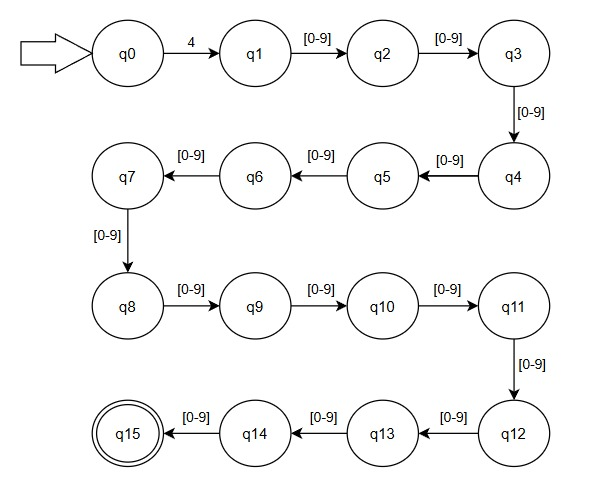
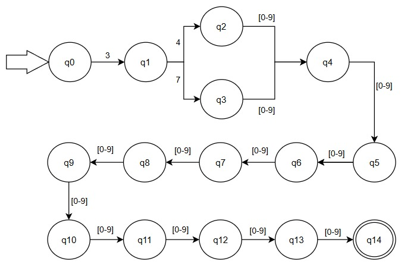
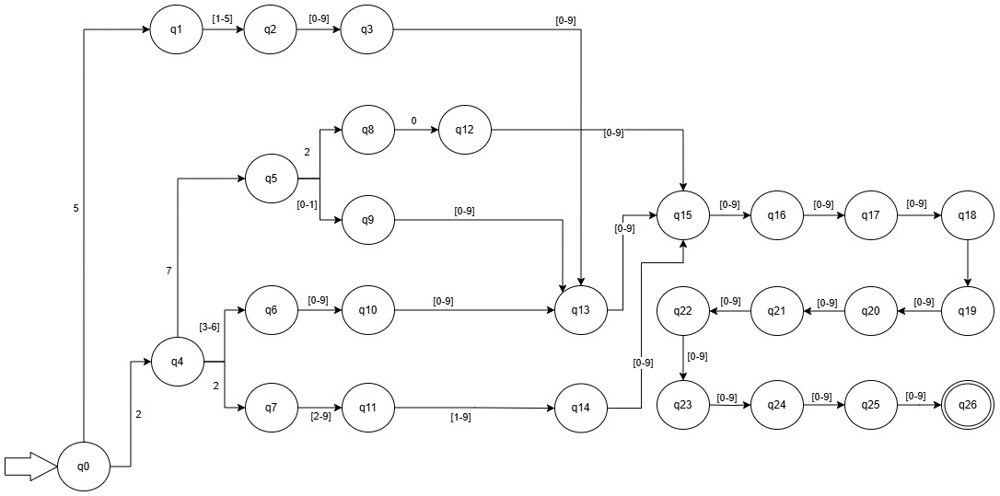

# Detector de tarjetas

Detector de tarjetas Visa, Mastercard y Amex, utilizando autómatas finitos.

## Demo

[Demo Detector de tarjetas](https://detector-de-tarjetas.netlify.app/)

## Documentación

Para el desarrollo de este proyecto, se generaron diagramas de autómatas finitos que representan la lógica de validación de los números de tarjetas de crédito. Cada autómata fue diseñado específicamente para identificar patrones característicos de tarjetas Visa, Mastercard y American Express, utilizando reglas basadas en los dígitos iniciales y la longitud esperada de cada tipo de tarjeta. Estos diagramas permiten visualizar de forma clara y estructurada el proceso de validación automática mediante recorridos por estados.

### Diagrama Visa

Las tarjetas Visa inician con "4" y contienen 16 dígitos.
Ejemplo: 
- 4000 1234 5678 9010

### Diagrama Amex

Las tarjetas Amex inician con "34" ó "37" y contienen 15 dígitos.
Ejemplo: 
- 3714 496353 98431
- 3400 000000 00009

### Diagrama Mastercard

Las tarjetas Mastercard inician con el rango "51-55" ó con el rango "2221-2720" y contienen 16 dígitos.
Ejemplo:
- 5555 5555 5555 4444
- 5105 1051 0510 5100
- 2223 0000 4843 0011
- 2711 0478 9243 4514

## Authors

- [@ruanovaAlan](https://github.com/ruanovaAlan)
- [@jenniferheal](https://github.com/jenniferheal)
